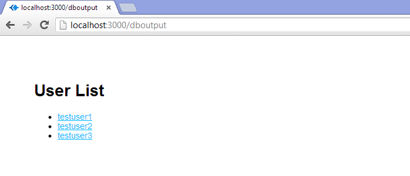
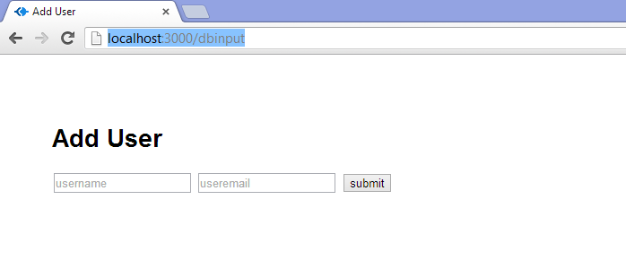

nejm
====

THE DEAD-SIMPLE STEP-BY-STEP GUIDE FOR FRONT-END DEVELOPERS TO GETTING UP AND RUNNING WITH NODE.JS, EXPRESS, JADE, AND MONGODB

SET UP THE FULL STACK AND HAVE A WEBPAGE RUNNING IN 30 MINUTES. MAKE IT TALK TO YOUR DB IN ANOTHER 30.

By [Christopher Buecheler](http://cwbuecheler.com/)

- [source](http://cwbuecheler.com/web/tutorials/2013/node-express-mongo/)
- [http://cwbuecheler.com/web/tutorials/2013/node-express-mongo/](https://github.com/cwbuecheler/node-tutorial-for-frontend-devs)

## Introduction

There are approximately one hundred million tutorials on the web for getting a "Hello, World!" app running with Node.js. This is great! It's especially great if your goal is to greet the world and then give up on your web career and go spend the rest of your life as, like, a jockey or something. That doesn't really describe most of us, so we go looking for more tutorials.

In my experience, the "next level" tutorials out there seem about 30 levels further along. We go from "Hello, World!" to building out an entire blogging system with comments. Which is also great, but a lot of times those tutorials assume the reader has done a whole bunch of intermediate fiddling, and they often drop a bunch of big functions on you all at once. I tend to learn best by making lots of smaller, intermediate steps, and I don't think I'm the only one.

I'm not the only one, right?

Well, [good news, everyone](http://www.youtube.com/watch?v=1D1cap6yETA)! I've done the fiddling and read a bunch of tutorials and shouted at my command prompt until things finally worked. I have a web project up and running which uses Node.JS, the Express framework, the Jade HTML pre-processor, and MongoDB for data. I can read to and write from the DB. From there, the sky's the limit.

Here's the deal: I'm going to show you how to get all of this stuff set up. I'll be assuming that you're a front-end developer who knows HTML5/CSS3/JavaScript well enough that I don't have to explain those. If that's you, then this should be a solid primer.

Your app will look pretty, it will connect to a DB, it'll get some results, and it'll do stuff with those results. Then for kicks we'll also make it save data to the DB. Through it all, I will explain what the code does, and how to write it, instead of just giving you massive functions to stare at. We'll go from nothing even installed, to a DB-driven web app written in a language you fully understand, and the foundation necessary to build additional functionality into your app. And we'll do it in about 60 minutes of installation and coding time. Is that awesome? I submit that it is.

Let's go.

### Part I – 15 minutes of installing

If you're really starting from scratch, then getting everything up and running takes a little bit of time. None of it is difficult. I run Windows 8 on my main machine, so it'll be slightly different for those on a Mac or Ubuntu or other *nix system, but it's principally the same thing in all cases.

#### Step 1 – Install Node.js

This is really easy. Hit the [Node.js website](http://nodejs.org/) and click the big green Install button. It'll detect your OS and give you the appropriate installer (if for some reason it doesn't, click the downloads button and grab the one you need). Run the installer. That's it, you have installed Node.js and, equally important, NPM – Node Package Manager – which lets you add all kinds of great stuff to Node quickly and easily.

- Open a command prompt
- cd to the directory in which you wish to keep your test apps(for the purposes of this tutorial, C:\node).

#### Step 2 – Install Express

Now that we have Node running, we need the rest of the stuff we're going to actually use to create a working website. To do that we're going to install Express, which is a framework that takes Node from a barebones application and turns it into something that behaves more like the web servers we're all used to working with (and actually quite a bit more than that). We need to start with Express, because we're going to use its scaffolding to get the rest of what we need (more on that in a second). So let's type this:

	Command C:\node\

	C:\node>npm install -g express

This installs some core Express functionality right into our Node installation, making it available globally so we can use it anywhere we want. That's handy. You'll see a bunch of text in your command prompt, mostly a lot of http 304's and GETs. That's fine. Express is now installed and available.

New: as of Express 4.0, you'll need to install the express "generator" as well. This is following a trend in the node industry of breaking out core functionality from site-scaffolding utility (check out [Yeoman](http://yeoman.io/) sometime if you want to learn a whole lot more about scaffolding options out there). Installing the generator is very easy: in the same console you used to install Express globally, type the following:

	Command C:\node>

	C:\node>npm install -g express-generator

The generator should auto-install, and since it (like all packages installed with -g) lives in your master NPM installation directory, it should already be available in your system path. So let's use our generator to create the scaffolding for a website.

#### Step 3 – Create an Express Project

We're going to use Express and Jade, but not the Stylus CSS preprocessor (which people often use in this stack). We're just going to use straight CSS for right now. We have to use Jade or another templating engine to gain access to our Node/Express-based data. Jade's not hard to learn if you already know HTML. Just remember that you really have to pay attention to indentation or things will go badly wrong. A quick note on that: everything is this tutorial has been normalized to 4-space tabs, even code that was auto-generated with 2-space tabs. If you want to use two or three spaces, or actual tabs (which is usually my preference), that's just fine by me.

Anyway, still in c:\node or wherever you're storing your node apps, type this:

	Command C:\node\

	C:\node>express nodetest1

Hit enter and watch it go. You'll see something like this:

	Command C:\node\

	C:\node>express nodetest1
	    create : nodetest1
	    create : nodetest1/package.json
	    create : nodetest1/app.js
	    create : nodetest1/public
	    create : nodetest1/public/javascripts
	    create : nodetest1/public/images
	    create : nodetest1/routes
	    create : nodetest1/routes/index.js
	    create : nodetest1/routes/users.js
	    create : nodetest1/public/stylesheets
	    create : nodetest1/public/stylesheets/style.css
	    create : nodetest1/views
	    create : nodetest1/views/index.jade
	    create : nodetest1/views/layout.jade
	    create : nodetest1/views/error.jade
	    create : nodetest1/bin
	    create : nodetest1/bin/www

	    install dependencies:
	     $ cd nodetest1 && npm install

	    run the app:
	     $ DEBUG=my-application ./bin/www

#### Step 4 – Edit Dependencies

OK, now we have some basic structure in there, but we're not quite done. You'll note that the express installation routine created a file called package.json in your nodetest1 directory. Open this up in a text editor and it'll look like this:

	C:\node\nodetest1\package.json

	{
	    "name": "application-name",
	    "version": "0.0.1",
	    "private": true,
	    "scripts": {
	        "start": "node ./bin/www"
	    },
	    "dependencies": {
	        "express": "~4.0.0",
	        "serve-favicon": "~2.1.3",
	        "morgan": "~1.0.0",
	        "cookie-parser": "~1.0.1",
	        "body-parser": "~1.0.0",
	        "debug": "~0.7.4",
	        "jade": "~1.3.0"
	    }
	}

This is a basic JSON file describing our app and its dependencies. We need to add a few things to it. Specifically, calls for MongoDB and Monk. Let's make our dependencies object look like this:

	"dependencies": {
	    "express": "~4.0.0",
	    "serve-favicon": "~2.1.3",
	    "morgan": "~1.0.0",
	    "cookie-parser": "~1.0.1",
	    "body-parser": "~1.0.0",
	    "debug": "~0.7.4",
	    "jade": "~1.3.0",
	    "mongodb": "*",
	    "monk": "*"
	}

#### Step 5 – Install Dependencies

Now we've defined our dependencies and we're ready to go. Note that the asterisks tell NPM "just get the latest version" when you run the install, which we're about to do.

Return to your command prompt, cd to your nodetest1 directory, and type this:

	Command C:\node\nodetest1\

	C:\node\nodetest1>npm install
	
It's going to print out a ton of stuff. That's because it's reading the JSON file we just edited and installing all the stuff listed in the dependencies object (yes, including Express – we installed the top level stuff using the –g flag, but we still have to install some necessary code for this particular project). Once NPM has run its course, you should have a node_modules directory which contains all of our dependencies for this tutorial.

You now have a fully-functioning app ready and waiting to run. Before we do that, though, we need to do one quick thing to prepare for setting up our database later. Still in your nodetest1 directory, type this:

	Command C:\node\nodetest1\

	C:\node\nodetest1>mkdir data
	
That's where we're eventually going to store our MongoDB data. If that directory doesn't exist, the database server will choke when we go to run it later. We're not doing anything with it right now, though, so let's test out our web server! Type the following:

	Command C:\node\nodtest1\

	C:\node\nodetest1>npm start

Note: in previous versions, you used "node app.js" -- this has been deprecated in favor of a skeletal build system. For the purposes of this tutorial, that doesn't really matter, since we're not worying about building. For our purposes, using "npm start" is essentially identical to previous versions of this tutorial. Anyway, type that and hit enter. You'll get this:

	Node Console

	> application-name@0.0.1 start D:\sites\node\nodetest1
	> node ./bin/www

Everything working? Awesome! Open a browser and head for [http://localhost:3000](http://localhost:3000/) where you will see a welcome to Express page.

Welcome to Express Page

You are now running your own Node JS webserver, with the Express engine and Jade HTML preprocessor installed. Not so tough, huh?

### Part 2 – OK, Fine, let's do "Hello, World!"

Fire up your favorite text editor or IDE. I like Sublime Text a lot. Point it at your nodetest1 directory and open app.js. This is kind of the heart of your, well, app. Not a big surprise there. Here's a breakdown of what you're going to see:

	C:\node\nodetest1\app.js

	var express = require('express');
	var path = require('path');
	var favicon = require('serve-favicon');
	var logger = require('morgan');
	var cookieParser = require('cookie-parser');
	var bodyParser = require('body-parser');

	var routes = require('./routes/index');
	var users = require('./routes/users');

This creates a bunch of basic JavaScript variables and ties them to certain packages, dependencies, node functionality, and routes. Routes are kind of like a combination of models and controllers in this setup – they direct traffic and also contain some programming logic (you can establish a more traditional MVC architecture with Express if you like. That's outside of the scope of this article). Back when we set up this project, Express created all of this stuff for us. We're going to totally ignore the user route for now and just work in the top level route (controlled by c:\node\nodetest1\routes\index.js).

	C:\node\nodetest1\app.js

	var app = express();

This one's important. It instantiates Express and assigns our app variable to it. The next section uses this variable to configure a bunch of Express stuff.

	C:\node\nodetest1\app.js

	// view engine setup
	app.set('views', path.join(__dirname, 'views'));
	app.set('view engine', 'jade');

	// uncomment after placing your favicon in /public
	//app.use(favicon(__dirname + '/public/favicon.ico'));
	app.use(logger('dev'));
	app.use(bodyParser.json());
	app.use(bodyParser.urlencoded());
	app.use(cookieParser());
	app.use(express.static(path.join(__dirname, 'public')));

	app.use('/', routes);
	app.use('/users', users);

This tells the app were to find its views, what engine to use to render those views (Jade), and calls a few methods to get things up and running. Note also that the final line is telling Express to serve static objects from the /public/ dir, but to make them actually seem like they're coming from the top level (it also does this with the views directory). For example, the images directory is c:\node\nodetest1\public\images … but it is accessed at [http://localhost:3000/images](http://localhost:3000/images)

	C:\node\nodetest1\app.js

	/// catch 404 and forwarding to error handler
	app.use(function(req, res, next) {
	    var err = new Error('Not Found');
	    err.status = 404;
	    next(err);
	});

	/// error handlers

	// development error handler
	// will print stacktrace
	if (app.get('env') === 'development') {
	    app.use(function(err, req, res, next) {
	        res.status(err.status || 500);
	        res.render('error', {
	            message: err.message,
	            error: err
	        });
	    });
	}

	// production error handler
	// no stacktraces leaked to user
	app.use(function(err, req, res, next) {
	    res.status(err.status || 500);
	    res.render('error', {
	        message: err.message,
	        error: {}
	    });
	});

These are error handlers for development and production (and 404's). We're not really worrying about the different between those two right now, but basically if your app is in development mode, your errors will give you more information. Obviously you don't want to print a stack trace out on a production site that anyone on the web can see.

	C:\node\nodetest1\app.js

	module.exports = app;

A core part of Node is that basically all modules export an object which can easily be called elsewhere in the code. Our master app exports its app object.

Now then, let's make stuff. We're not going to just stick "Hello, World!" on our index page. Instead we're going to use this as an opportunity to learn a bit more about routes and to take a look at how Jade works for putting pages together.

We're going to start by adding a new app.use directive to app.js. Find the section that looks like this:

	C:\node\nodetest1\app.js

	app.use('/', routes);
	app.use('/users', users);

This directives are telling Express what route files to use. Now, normally I'd advocate setting up separate route files for different parts of your app. For example, the users route file might contain routes for adding users, deleting them, updating them, and so forth, while a new route file called "locations" might handle adding, editing, deleting and displaying location data (in an app for which that was required). In this case, to keep things simple, we're going to do everything in the index router. That means you can completely ignore the /users line.

Remember that the Express scaffolding already defined the "routes" variable and pointed it at the index router. We're going to add a "helloworld" method to that router which will render a different page than the default. In your text editor, open up your routes folder, find index.js, and open it. It will look like this:

	C:\node\nodetest1\routes\index.js

	var express = require('express');
	var router = express.Router();

	/* GET home page. */
	router.get('/', function(req, res) {
	    res.render('index', { title: 'Express' });
	});

	module.exports = router;

Pretty sparse, right? Basically we're requiring our Express functionality, then attaching a "router" variable to Express's router method, then using that method when an attempt is made to HTTP get the top level directory of our website. Finally we export our router function back to our app.

We can easily clone that get function for another page, so let's do that. At the bottom of the file, just above the module.exports line, add this code:

C:\node\nodetest1\routes\index.js

/* GET Hello World page. */
router.get('/helloworld', function(req, res) {
    res.render('helloworld', { title: 'Hello, World!' })
});
That's all it takes to handle routing the URI, but we don't have any actual page for res.render to … render. That's where Jade comes in. Open up your views folder, and then go ahead and open index.jade. Before you do anything else, save it as helloworld.jade.

Now take a look at the code:

	C:\node\nodetest1\views\helloworld.jade

	extends layout

	block content
	    h1= title
	    p Welcome to #{title}
		
This is pretty straightforward. It uses ("extends") the file layout.jade as a template, and then within the content block defined in the layout file, it sticks a header and a paragraph. Note the use of the "title" variable which we set above, in our index.js route. This means we don't even have to change the text at all in order for it to show different stuff from the home page. But let's change it anyway to:

p Hello, World! Welcome to #{title}
Save the file, go to your command prompt, ctrl-c to kill your server if it's already running, and then type:

	Command C:\node\nodetest1\

	npm start

In order to restart the server. By the way, this seems a good time to mention: changes to Jade templates do not require a server restart, but basically whenever you change a js file, such as app.js or the route files, you'll need to restart to see changes.

SO … with the server restarted, navigate to [http://localhost:3000/helloworld](http://localhost:3000/helloworld) and enjoy the completely asinine text that gets displayed:

OK! So now we've got our router routing us to our view, which we are viewing. Let's do some modeling. I'll give you a moment if you need to fix your hair or makeup.

### Part 3 – Create our DB and read stuff from it

#### Step 1 – Install MongoDB

We're leaving our text editor for a bit and going back to our command prompt. Well, first we're going to our web browser, pointing it to [http://mongodb.org/](http://mongodb.org/) and downloading Mongo. Click the downloads link in the main menu and snag the production release that fits your system. For Windows 8 on a 64-bit processor, we want "64-bit *2008R2+". This will give you a zip file, which you should unzip to a temp directory. Then you should make a directory where you want to forever after store Mongo. You could use c:\mongo or c:\program files\mongo or any other crazy thing you want. It doesn't really matter – Mongo itself is quite small, and we'll be storing our database in our nodetest1 directory.

Anyway, copy the files in the bin folder within your temp directory to wherever you want Mongo to live, and you're done. You've installed Mongo. Now let's make it do stuff.

#### Step 2 – Run mongod and mongo

In your nodetest1 directory, create a subdir called "data". Then navigate to the directory in which you placed your MongoDB files (let's say C:\mongodb for now). From that directory, type the following:

	Command C:\mongo\

	mongod --dbpath c:\node\nodetest1\data

You'll see the Mongo server start up. This is going to take a while if it's the first time, because it has to do some preallocating of space and a few other housekeeping tasks. Once it says "[initandlisten] waiting for connections on port 27017", you're good. There's nothing more to do here; the server is running. Now you need to open a second command prompt. Navigate again to your Mongo installation directory, and type:

	Command C:\mongo\

	mongo
	You'll see something like the following:

	Mongo Console

	c:\mongo>mongo
	MongoDB shell version: 2.4.5
	connecting to: test

Additionally, if you're paying attention to your mongod instance, you'll see it mention that a connection has been established. All right, you've got MongoDB up and running, and you've connected to it with the client. We'll use this client to manually work on our database, for a bit, but it's not necessary for running the website. Only the server daemon (mongod) is needed for that.

#### Step 3 – Create a Database

Don't worry about "connecting to: test" … that's just the default database Mongo decides to use if you don't specify one on the command line, which we didn't because it's not important right now. It doesn't actually even create the "test" database unless you add a record. It'd be totally fine to just work in that database for right now, but let's make one of our own. In your Mongo console, type the following:

	Mongo Console

	use nodetest1
	
Now we're using the database "nodetest1." Like with "test", nothing actually exists yet. To make the database exist, we have to add some data. We're going to start off by doing that right inside of the Mongo client.

#### Step 4 – Add some Data

My favorite thing about MongoDB is that it uses JSON for its structure, which means it was instantly familiar for me. If you're not familiar with JSON, you'll need to do some reading, as I'm afraid that's outside the scope of this tutorial.

Let's add a record to our collection. For the purposes of this tutorial, we're just going to have a simple database of usernames and email addresses. Our data format will thus look like this:

	Mongo Console

	{
	    "_id" : 1234,
	    "username" : "cwbuecheler",
	    "email" : "cwbuecheler@nospam.com"
	}

You can create your own _id assignment if you really want, but I find it's best to let Mongo just do its thing. It will provide a unique identifier for every single top-level collection entry. Let's add one and see how it works. In your Mongo client, type this:

	Mongo Console

	db.usercollection.insert({ "username" : "testuser1", "email" : "testuser1@testdomain.com" })

Something important to note here: that "db" stands for our database, which as mentioned above we've defined as "nodetest1". The "usercollection" part is our collection. Note that there wasn't a step where we created the "usercollection" collection. That's because the first time we add to it, it's going to be auto-created. Handy. OK, Hit enter. Assuming everything went right, you should see … nothing. That's not very exciting, so type this:

	Mongo Console

	db.usercollection.find().pretty()

In case you're curious, the .pretty() method gives us linebreaks. It will return:

	Mongo Console

	{
	    "_id" : ObjectId("5202b481d2184d390cbf6eca"),
	    "username" : "testuser1",
	    "email" : "testuser1@testdomain.com"
	}

Except, of course, your ObjectID will be different, since as mentioned, Mongo is automatically generating those. That's all there is to writing to MongoDB from the client app, and if you've ever worked with JSON services before, you are probably going "oh, wow, that's going to be easy to implement on the web." … you're right!

A quick note on DB structure: obviously in the long run you're unlikely to be storing everything at the top level. There are a ton of resources on the internet for schema design in MongoDB. Google is your friend!

Now that we've got one record, let's add a a couple more. In your Mongo console, type the following:

	Mongo Console

	newstuff = [{ "username" : "testuser2", "email" : "testuser2@testdomain.com" }, { "username" : "testuser3", "email" : "testuser3@testdomain.com" }]
	db.usercollection.insert(newstuff);

Note that, yes, we can pass an array with multiple objects to our collection. Handy! Another use of db.usercollection.find().pretty() will show all three records:

	Mongo Console

	{
	        "_id" : ObjectId("5202b481d2184d390cbf6eca"),
	        "username" : "testuser1",
	        "email" : "testuser1@testdomain.com"
	}
	{
	        "_id" : ObjectId("5202b49ad2184d390cbf6ecb"),
	        "username" : "testuser2",
	        "email" : "testuser2@testdomain.com"
	}
	{
	        "_id" : ObjectId("5202b49ad2184d390cbf6ecc"),
	        "username" : "testuser3",
	        "email" : "testuser3@testdomain.com"
	}

Now we're going to start actually interacting with the web server and site that we set up earlier.

#### Step 5 – Hook Mongo up to Node

This is where the rubber meets the road. Let's start by building a page that just spits out our DB entries in a mildly pretty form. Here's the HTML we're shooting to generate:

	<ul>
	    <li><a href="mailto:testuser1@testdomain.com">testuser1</a></li>
	    <li><a href="mailto:testuser2@testdomain.com">testuser2</a></li>
	    <li><a href="mailto:testuser3@testdomain.com">testuser3</a></li>
	</ul>

I know this isn't rocket science, but that's the point. We're just doing a simple DB read-and-write in this tutorial, not trying to build a whole website. First things first, we need to add a few lines to our main app.js file – the heart and soul of our app – in order to actually connect to our MongoDB instance. Open C:\node\nodetest1\app.js and at the top you'll see:

	C:\node\nodetest1\app.js

	var express = require('express');
	var path = require('path');
	var favicon = require('serve-favicon');
	var logger = require('morgan');
	var cookieParser = require('cookie-parser');
	var bodyParser = require('body-parser');

Now add these three lines:

	C:\node\nodetest1\app.js

	var express = require('express');
	var path = require('path');
	var favicon = require('serve-favicon');
	var logger = require('morgan');
	var cookieParser = require('cookie-parser');
	var bodyParser = require('body-parser');

	// New Code
	var mongo = require('mongodb');
	var monk = require('monk');
	var db = monk('localhost:27017/nodetest1');

These lines tell our app we want to talk to MongoDB, we're going to use Monk to do it, and our database is located at localhost:27017/nodetest1. Note that 27017 is the default port your MongoDB instance should be running on. If for some reason you've changed it, obviously use that port instead. Now look at the bottom of the file, where you have this:

	C:\node\nodetest1\app.js

	app.use('/', routes);
	app.use('/users', users);

We need to do some work here. Those app.use statements (along with the others you'll find in app.js) are establishing middleware for Express. The short, simple explanation is: they're providing custom functions that the rest of your app can make use of. It's pretty straightforward, but due to chaining it needs to come before our route definitions, so that they can make use of it.

Above the two lines just mentioned, add the following:

	C:\node\nodetest1\app.js

	// Make our db accessible to our router
	app.use(function(req,res,next){
	    req.db = db;
	    next();
	});

NOTE: If you don't put this above the routing stuff mentioned above (app.use('/', routes);), your app WILL NOT WORK.

We already defined "db" when we added Mongo and Monk to app.js. It's our Monk connection object. By adding this function to app.use, we're adding that object to every HTTP request (ie: "req") our app makes. Note: this is probably sub-optimal for performance but, again, we're going quick-n-dirty here.

So, again, that code needs to go above our routing code. Your entire app.js should look like this, now:

	C:\node\nodetest1\app.js

	var express = require('express');
	var path = require('path');
	var favicon = require('serve-favicon');
	var logger = require('morgan');
	var cookieParser = require('cookie-parser');
	var bodyParser = require('body-parser');

	// New Code
	var mongo = require('mongodb');
	var monk = require('monk');
	var db = monk('localhost:27017/nodetest1');

	var routes = require('./routes/index');
	var users = require('./routes/users');

	var app = express();

	// view engine setup
	app.set('views', path.join(__dirname, 'views'));
	app.set('view engine', 'jade');

	// uncomment after placing your favicon in /public
	//app.use(favicon(__dirname + '/public/favicon.ico'));
	app.use(logger('dev'));
	app.use(bodyParser.json());
	app.use(bodyParser.urlencoded());
	app.use(cookieParser());
	app.use(express.static(path.join(__dirname, 'public')));

	// Make our db accessible to our router
	app.use(function(req,res,next){
	    req.db = db;
	    next();
	});

	app.use('/', routes);
	app.use('/users', users);

	/// catch 404 and forwarding to error handler
	app.use(function(req, res, next) {
	    var err = new Error('Not Found');
	    err.status = 404;
	    next(err);
	});

	/// error handlers

	// development error handler
	// will print stacktrace
	if (app.get('env') === 'development') {
	    app.use(function(err, req, res, next) {
	        res.status(err.status || 500);
	        res.render('error', {
	            message: err.message,
	            error: err
	        });
	    });
	}

	// production error handler
	// no stacktraces leaked to user
	app.use(function(err, req, res, next) {
	    res.status(err.status || 500);
	    res.render('error', {
	        message: err.message,
	        error: {}
	    });
	});

	module.exports = app;
	
Next thing we need to do is modify our route so that we can actually show data that's held in our database, using our db object.

#### Step 6 – Pull your data from Mongo and display it

Open up C:\node\nodetest1\routes\index.js in your editor. It's still got the index route, and the goofy /helloworld route. Let's add a third:

	C:\node\nodetest1\routes\index.js

	/* GET Userlist page. */
	router.get('/userlist', function(req, res) {
	    var db = req.db;
	    var collection = db.get('usercollection');
	    collection.find({},{},function(e,docs){
	        res.render('userlist', {
	            "userlist" : docs
	        });
	    });
	});

OK … that's getting fairly complicated. All it's really doing, though, is extracting the "db" object we passed to our http request, and then using that db connection to fill our "docs" variable with database documents, ie: user data. Then we do a page render just like the other two "gets" in this route file.

Basically, we tell our app which collection we want to use ('usercollection') and do a find, then return the results as the variable "docs". Once we have those documents, we then do a render of userlist (which will need a corresponding Jade template), giving it the userlist variable to work with, and passing our database documents to that variable.

Next let's set up our Jade template. Navigate to C:\node\nodetest1\views\ and open index.jade. Once again, immediately save it as userlist.jade. Then edit the HTML so it looks like this:

	C:\node\nodetest1\view\userlist.jade

	extends layout

	block content
	    h1.
	        User List
	    ul
	        each user, i in userlist
	            li
	                a(href="mailto:#{user.email}")= user.username
								
								
This is saying that we're going to pull in the set of documents we just called userlist over in the route file, and then for each entry (named 'user' during the loop), get the email and username values from the object and put them into our html. We've also got the count – i – handy in case we need it, though in this instance we don't.

We're all set. Save that file, and let's restart our node server. Remember how to do that? Go to your command prompt, head for C:\node\nodetest1\ and ctrl-c to kill your server if it's still running from way back before. Then type:

	Command C:\node\nodetest1\

	C:\node\nodetest1>npm start

Now open your browser and head to http://localhost:3000/userlist and marvel in the results.

You're now pulling data from the DB and spitting it out onto a web page. Nice!

There one more thing I badly wanted to cover in this tutorial, but because it's already about as long as the Bible, I'm going to breeze through it here. You could very easily change your userlist view from an Express-driven web page complete with Jade template to a plain old JSON response. You could then access this with AJAX and manipulate it on the client-side, with jQuery for example, instead of on the server side. In fact, I wanted to cover that so badly that I wrote an entire second tutorial on it. You can find the link at the end of this one!

Let's finish this up.

### Part 4 – The holy grail: writing to the DB

Writing to the database is not particularly difficult. Essentially we need to set up a route that takes a POST, rather than a GET.

#### Step 1 – Create your data input

We're going quick and dirty here: two ugly, unstyled text inputs and a submit button. 1996-style, but before we get to that, we're going to do some javacripting. Let's start by quickly wiring up a route for our add user form. Open /routes/index.js and add the following code above the last module.exports line:

	C:\node\nodetest1\routes\index.js

	/* GET New User page. */
	router.get('/newuser', function(req, res) {
	    res.render('newuser', { title: 'Add New User' });
	});

Now we just need a template. Open up /views/index.jade, save it as newuser.jade, and replace the whole file contents with this:

	C:\node\nodetest1\views\newuser.jade

	extends layout

	block content
	    h1= title
	    form#formAddUser(name="adduser",method="post",action="/adduser")
	        input#inputUserName(type="text", placeholder="username", name="username")
	        input#inputUserEmail(type="text", placeholder="useremail", name="useremail")
	        button#btnSubmit(type="submit") submit
				
Here we're creating a form with the ID "formAddUser" (I like to preface my IDs with the type of thing we're ID'ing. It's a personal quirk). Method is post, action is adduser. Pretty straightforward. Under that we've defined our two inputs and our button.

If you restart your node server and go to [http://localhost:3000/newuser](http://localhost:3000/newuser) you'll see your form in all its glory.

Go ahead and submit. Enjoy the 404 error. We're about to fix that.

#### Step 2 – Create your DB functions

OK, this is pretty much the same process as with the user list. We don't need another app.use statement since we've already wrapped our database object into every request (see above). That means it'll be accessible to any new routes we write. That means that all we need to do is add a route for POSTing to /adduser.

Go back to /routes/index.js and let's create our insertion function. Once again, you'll want to put this above the final module.exports line (it doesn't REALLY matter, but it makes things cleaner to wrap up with the export). This is a big one, so I've commented the code pretty thoroughly. Here it is:

	C:\node\nodetest1\routes\index.js

	/* POST to Add User Service */
	router.post('/adduser', function(req, res) {

	    // Set our internal DB variable
	    var db = req.db;

	    // Get our form values. These rely on the "name" attributes
	    var userName = req.body.username;
	    var userEmail = req.body.useremail;

	    // Set our collection
	    var collection = db.get('usercollection');

	    // Submit to the DB
	    collection.insert({
	        "username" : userName,
	        "email" : userEmail
	    }, function (err, doc) {
	        if (err) {
	            // If it failed, return error
	            res.send("There was a problem adding the information to the database.");
	        }
	        else {
	            // If it worked, set the header so the address bar doesn't still say /adduser
	            res.location("userlist");
	            // And forward to success page
	            res.redirect("userlist");
	        }
	    });
	});
	
	
Obviously in the real world you would want a ton more validating, error-checking, and the like. You'd want to check for duplicate usernames and emails, for example. And to vet that the email address at least looks like a legit entry. But this'll work for now. As you can see, on successfully adding to the DB, we forward the user back to the userlist page, where they should see their newly added user.

Are there smoother ways to do this? Absolutely. We're staying as bare-bones as possible here. Now, let's go add some data!

#### Step 3 – Connect and add data to your DB

Make sure mongod is running! Then head to your command prompt, kill your node server if it's still running, and restart it:

	Command C:\node\nodetest1\

	C:\node\nodetest1>npm start

Assuming your server is running, which it should be, return to your web browser and point it at http://localhost:3000/newuser again. There's our exciting form, just like before. Except now let's fill in some values before we hit submit. I went with username "noderocks" and email "noderocks@rockingnode.com" ... you can go with whatever you'd like.

Click submit, and check it out ... we're back at /userlist and there's our new entry!

We are officially reading and writing from a MongoDB database using Node.js, Express, and Jade. You are now what the kids call a "full stack" developer (probably not a GOOD one, just yet, but I didn't promise that).

Congratulations. Seriously. If you followed this all the way through, and if you really paid attention to what you were doing and didn't just paste code, you should have a really solid grasp on routes and views, reading from the DB, and posting to the DB. That is all you need to get started developing whatever app you want to build. I don't know about you, but I think that's really cool.

#### Part 5 – Next steps

From here, there's a million different directions you could go. You could check out [Mongoose](http://mongoosejs.com/), which is another Mongo-manipulation package for Node/Express. It's bigger than Monk, but it also does more. You could check out Stylus, the CSS preprocessor that comes with Express. You could google "Node Express Mongo Tutorial" and see what comes up. Just keep exploring and keep building!

I hope this tutorial's been helpful. I wrote it because I could've used it when I got started, and I couldn't seem to find something that was quite at this level, or that broke things down in such long, long, loooong detail. If you made it this far, thanks for sticking with it!

**NEW**: The "sequel" to this tutorial is now available! Find it at: [Creating a Simple RESTful Web App with Node.js, Express, and MongoDB](http://cwbuecheler.com/web/tutorials/2014/restful-web-app-node-express-mongodb/).

Merci Beaucoup

I owe a huge debt of thanks to the following code-slingers whose tutorials, slides, presentations, videos, and tweets helped me to figure all of this stuff out. You guys rock!

- [Raquel "Rockbot" Velez](http://rckbt.me/) (@rockbot), whose video presentation []"Front-End Development in Node.js"](http://www.youtube.com/watch?v=icNHLlRazds) from [jqConf Portland](http://events.jquery.org/) got me interested enough to finally dig my thumbs into Node. She is a talented web developer, gives a fun talk, and also writes code for robots!
- Azat Mardanov, whose article ["Intro to Express.js: Simple REST API app with Monk and MongoDB"](http://webapplog.com/intro-to-express-js-simple-rest-api-app-with-monk-and-mongodb/) helped me a ton with establishing a basic understanding of how all of these different pieces talk to each other.
- Jason Everett, whose article ["A Sample App with Node.js, Express and MongoDB – Part 1"](http://blog.ijasoneverett.com/2013/03/a-sample-app-with-node-js-express-and-mongodb-part-1/) helped me pick up some important knowledge.
- Ciaran Jessup, whose article ["Blog rolling with mongoDB, express and Node.js"](http://howtonode.org/express-mongodb) over at [How To Node](http://howtonode.org/) was another good resource!

## About the author

Christopher Buecheler is an autodidact polymath, which is an incredibly pretentious way of saying that he's a jack of all trades who didn't like college. By day he's a front-end developer for a small San Francisco startup. By night he's a popular novelist, with four books released. He also is an award-winning amateur mixologist who writes cocktail articles for Primer Magazine and runs a cocktail blog, and he brews beer on occasion. He follows the NBA avidly and the NFL casually (and sometimes glances at MLB). He lives in Providence, Rhode Island, with his awesome French wife and their two cats. He is trying to learn French but wishes he could just download it from the Matrix.